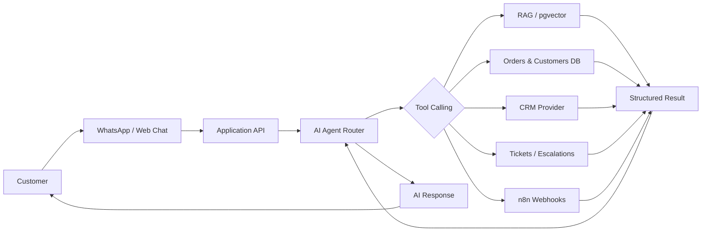
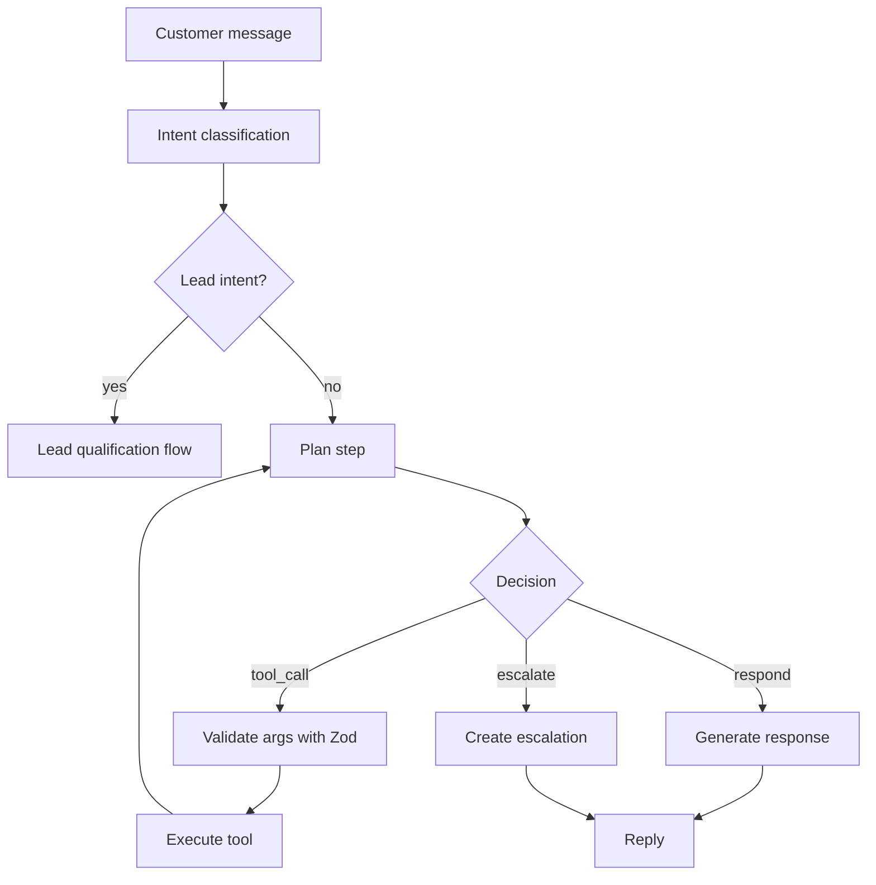
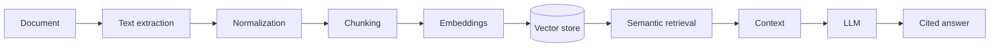

# AgentDesk AI

**AI Customer Support & Sales Automation Platform** — a production-style SaaS application that proves how to build AI systems around real business workflows, not just call an LLM API.

AgentDesk AI combines an AI agent with real tool calling, RAG knowledge retrieval, CRM sync, human-in-the-loop escalation, n8n automation, WhatsApp/web channels, background jobs and observability.

---

## Table of contents

1. [Product overview](#product-overview)
2. [Features](#features)
3. [Architecture](#architecture)
4. [AI Agent architecture](#ai-agent-architecture)
5. [Tool calling](#tool-calling)
6. [RAG architecture](#rag-architecture)
7. [n8n workflows](#n8n-workflows)
8. [CRM integration](#crm-integration)
9. [WhatsApp integration](#whatsapp-integration)
10. [Reliability design](#reliability-design)
11. [AI evaluations](#ai-evaluations)
12. [Local installation](#local-installation)
13. [Environment variables](#environment-variables)
14. [Demo instructions](#demo-instructions)
15. [Testing](#testing)
16. [Deployment](#deployment)
17. [Known limitations](#known-limitations)
18. [Future roadmap](#future-roadmap)

---

## Product overview

Businesses receive messages through WhatsApp and web chat. AgentDesk AI:

1. Answers customer support questions
2. Searches a company knowledge base
3. Checks customer/order information
4. Qualifies sales leads
5. Creates/updates CRM records
6. Schedules meetings
7. Creates support tickets
8. Escalates conversations to humans
9. Triggers business workflows
10. Tracks everything in an admin dashboard

The agent uses **real tools and real data** — it never invents order numbers, customer details or policies.

## Features

- **AI Agent** with structured tool calling (`get_order_status`, `search_knowledge_base`, `qualify_lead`, `create_crm_deal`, `escalate_to_human`, `refund_order`, …)
- **RAG knowledge base** — PDF/TXT/Markdown/manual ingestion → chunking → embeddings → semantic retrieval with source citations
- **Human-in-the-loop** — low-confidence, sensitive actions (refunds above a threshold) and customer requests escalate for approval
- **CRM abstraction** — HubSpot provider + a clearly-labelled demo provider
- **n8n automations** — 4 importable workflows (qualified lead, escalation, KB update, follow-up)
- **WhatsApp Cloud API** — webhook verification, signature validation, idempotency
- **Web chat** — the same agent experience with zero credentials
- **Background jobs** — retries, exponential backoff, idempotency, dead-letter
- **Observability** — audit log of every AI request, tool call, CRM sync and webhook
- **AI evaluation suite** — 67 predefined scenarios with real, measured metrics
- **Admin dashboard** — overview, conversations, leads, tickets, knowledge, automations, evaluations, logs, settings

## Architecture

```
Customer
  ↓
WhatsApp / Web Chat
  ↓
Application API (route handlers + idempotency)
  ↓
AI Agent Router (intent → tool selection)
  ↓
Tool calling (validated with Zod schemas)
  ↓
Business APIs / RAG / CRM / Orders / Tickets
  ↓
Structured tool result
  ↓
AI response
  ↓
Customer
```



**Technology stack**

| Layer | Choice |
| --- | --- |
| Frontend | Next.js 16 (App Router), React 19, TypeScript, Tailwind CSS 4 |
| Backend | Next.js route handlers / server components, TypeScript |
| Database | Prisma ORM — SQLite for zero-dependency demo, PostgreSQL + pgvector for production |
| Auth | Custom session auth (signed httpOnly cookies, bcrypt, role-based) |
| AI | OpenAI (SDK) behind an `LLMProvider` abstraction with a deterministic demo provider |
| RAG | Chunking + embeddings behind a `VectorStore` abstraction (JS-cosine demo, pgvector production) |
| Automation | n8n (webhooks both directions) |
| Messaging | WhatsApp Cloud API + web chat |
| CRM | HubSpot behind a `CRMProvider` abstraction |
| Testing | Vitest, React Testing Library, Playwright |

## AI Agent architecture

The agent is **not** a "user → LLM → text" wrapper. Every turn follows a deterministic loop:



Key source files:

- `src/lib/ai/agent.ts` — the agent loop (intent → plan → execute → respond)
- `src/lib/ai/providers/demo.ts` — deterministic reference provider (no key)
- `src/lib/ai/providers/openai.ts` — OpenAI provider (function calling)
- `src/lib/ai/tools/index.ts` — tool registry with Zod schemas + implementations
- `src/lib/ai/lead.ts` — transparent lead qualification flow

**Provider abstraction** (`LLMProvider`) lets the same loop run offline (deterministic demo) or live (OpenAI), and is where Anthropic/Claude can be added later.

## Tool calling

The agent has a registry of tools, each with a Zod schema and an implementation that reads **real data**:

| Tool | Purpose | Sensitive |
| --- | --- | --- |
| `get_customer_profile` | Customer + order history | no |
| `get_order_status` | Order lookup by number | no |
| `search_knowledge_base` | RAG retrieval with citations | no |
| `create_support_ticket` | Create a ticket | no |
| `qualify_lead` | Transparent lead scoring | no |
| `create_crm_contact` | CRM contact (via provider) | no |
| `create_crm_deal` | CRM deal (via provider) | no |
| `book_meeting` | Schedule a meeting | no |
| `escalate_to_human` | Escalate to a human | no |
| `refund_order` | Process a refund | **yes** |

Tool arguments are validated against their Zod schema before execution. Invalid arguments produce a logged failure rather than a crash. If information is unavailable, the agent says so. If confidence is low or an action is sensitive, it escalates.

## RAG architecture



- `src/lib/rag/ingest.ts` — document ingestion pipeline
- `src/lib/rag/chunker.ts` — paragraph/sentence chunking with overlap
- `src/lib/rag/embedder.ts` — deterministic demo embedder + OpenAI embeddings
- `src/lib/rag/vectorstore.ts` — retrieval (in-process cosine by default)

Demo mode uses a deterministic local embedder and in-process cosine similarity (no network). Production uses `text-embedding-3-small` and pgvector — see [`docs/rag.md`](docs/rag.md) and `prisma/pgvector.sql`.

The agent returns source references with retrieved content and will **not** answer confidently when retrieval confidence is poor.

## n8n workflows

Four importable workflows live in [`n8n/workflows/`](n8n/workflows/):

1. **Qualified Lead** — AI qualifies → webhook → HubSpot contact → HubSpot deal → Slack notify
2. **Support Escalation** — AI escalates → create ticket → assign → Slack notify
3. **Knowledge Base Update** — Google Drive file → extract → send to ingestion endpoint
4. **Lead Follow-up** — wait → check CRM state → send follow-up

See [`docs/n8n.md`](docs/n8n.md) for import and configuration steps.

## CRM integration

`CRMProvider` abstraction with two implementations:

- `HubSpotProvider` — real HubSpot v3 REST API calls (create/update/search contact, create/update deal, associate)
- `DemoCRMProvider` — clearly-labelled local provider that records activity without external calls

Business logic depends only on the interface, so HubSpot is never tightly coupled. See [`docs/integrations.md`](docs/integrations.md).

## WhatsApp integration

`src/lib/messaging/whatsapp.ts` implements webhook verification (`hub.challenge`), HMAC signature validation (`X-Hub-Signature-256`), inbound message parsing, outbound sends, and idempotency via the message id. The web chat provides the same agent experience without credentials. See [`docs/integrations.md`](docs/integrations.md).

## Reliability design

External actions are designed to survive transient failures:

- **Background jobs** — database-backed `WorkflowRun` rows (`src/lib/automation/jobs.ts`)
- **Retries** — exponential backoff, capped
- **Idempotency** — unique `idempotencyKey` prevents duplicate side effects (webhooks, jobs, messages)
- **Dead-letter** — failed jobs land in a `DEAD` state for manual retry
- **Observability** — every event is audit-logged with status, latency and retry count

## AI evaluations

The evaluation suite (`src/lib/eval/`) runs **67 predefined scenarios** across intent classification, tool selection, escalation, invalid inputs and edge cases. It measures — and only displays — real metrics produced by actual runs:

- Intent classification accuracy
- Tool selection accuracy
- Escalation correctness
- Average latency
- Estimated cost (explicit demo model)

See [`docs/testing.md`](docs/testing.md) and the **Evaluations** page in the dashboard.

---

## Local installation

**Prerequisites:** Node.js 20.9+ (tested on 24).

```bash
# 1. Install dependencies
npm install

# 2. Configure environment
cp .env.example .env

# 3. Create the database and seed demo data
npx prisma db push
npm run db:seed

# 4. Start the app
npm run dev
```

Open http://localhost:3000. **No API keys or Docker required** — the app runs fully offline in demo mode.

### Demo credentials

| Role | Email | Password |
| --- | --- | --- |
| Admin | `admin@agentdesk.ai` | `admin123` |
| Agent | `agent@agentdesk.ai` | `agent123` |

## Environment variables

All configuration is via environment variables (see [`.env.example`](.env.example)). Everything is optional; the app defaults to deterministic demo mode:

| Variable | Purpose |
| --- | --- |
| `DATABASE_URL` | SQLite (default) or PostgreSQL |
| `AUTH_SECRET` | Session signing secret |
| `DEMO_MODE` | `true` (default) forces deterministic demo providers |
| `OPENAI_API_KEY` | Enables the live OpenAI provider |
| `EMBEDDING_PROVIDER` | `demo` (default) or `openai` |
| `HUBSPOT_ACCESS_TOKEN` | Enables the live HubSpot provider |
| `WHATSAPP_TOKEN`, `WHATSAPP_PHONE_NUMBER_ID`, `WHATSAPP_APP_SECRET`, `WHATSAPP_VERIFY_TOKEN` | Enables live WhatsApp |
| `N8N_WEBHOOK_URL` | Outbound automation webhook |

## Demo instructions

1. Start the app and open the **Web Chat** (`/chat`) — no signup required.
2. Try the seeded scenarios:
   - "Where is order #4582?"
   - "What is your refund policy?"
   - "I run a 25-person company and want AI customer support."
   - "I want to speak to a human."
   - "I need a $500 refund."
3. Sign in to the dashboard and inspect the resulting conversations, tool calls, sources, escalations, leads, logs and workflow runs.

Everything is clearly labelled as demo data. Demo integrations never make real external calls and are never presented as real HubSpot/WhatsApp activity.

## Testing

```bash
npm run test        # Vitest unit tests
npm run lint        # ESLint
npm run typecheck   # TypeScript
npm run e2e         # Playwright (requires a running app)
```

- **Unit tests** cover chunking, embeddings, intent classification, lead scoring, settings and tool planning.
- **AI evaluations** run in the dashboard (or via `npm run test`) and produce the measured metrics.
- **Playwright** covers the key end-to-end flow: login → dashboard → web chat → agent response.

## Deployment

- **App**: Vercel (Next.js). Set `DATABASE_URL` to a hosted PostgreSQL (Neon/Supabase with pgvector) and the secrets above.
- **Database**: any hosted PostgreSQL with pgvector. Apply `prisma/pgvector.sql` for vector retrieval.
- **n8n**: self-hosted (n8n Cloud or Docker) — point `N8N_WEBHOOK_URL` at it and import `n8n/workflows/*.json`.
- **Jobs**: run `/api/automations/run` on a schedule (Vercel Cron) to process due background jobs.

## Known limitations

- Demo embeddings are a deterministic hash-based bag-of-words; suitable for demonstrating the pipeline, not for production retrieval quality.
- The job runner is an in-process sweep (no Redis); production would drive `processDueJobs()` from a scheduler.
- Google Drive integration is documented but not implemented (the abstraction and manual upload are in place).
- Auth is a single-tenant demo model (one workspace); multi-tenant is a documented extension.

## Future roadmap

- Anthropic/Claude provider (the `LLMProvider` interface is already provider-agnostic)
- Voice AI (Vapi/Retell) reusing the same tool layer
- Multi-tenant workspaces and organization invites
- Google Drive ingestion provider
- Redis-backed queue for high-throughput job processing
- Real API cost tracking from provider usage endpoints

---

See the full documentation in [`docs/`](docs/):

- [`architecture.md`](docs/architecture.md)
- [`agent-system.md`](docs/agent-system.md)
- [`rag.md`](docs/rag.md)
- [`n8n.md`](docs/n8n.md)
- [`integrations.md`](docs/integrations.md)
- [`testing.md`](docs/testing.md)
- [`case-study.md`](docs/case-study.md)
