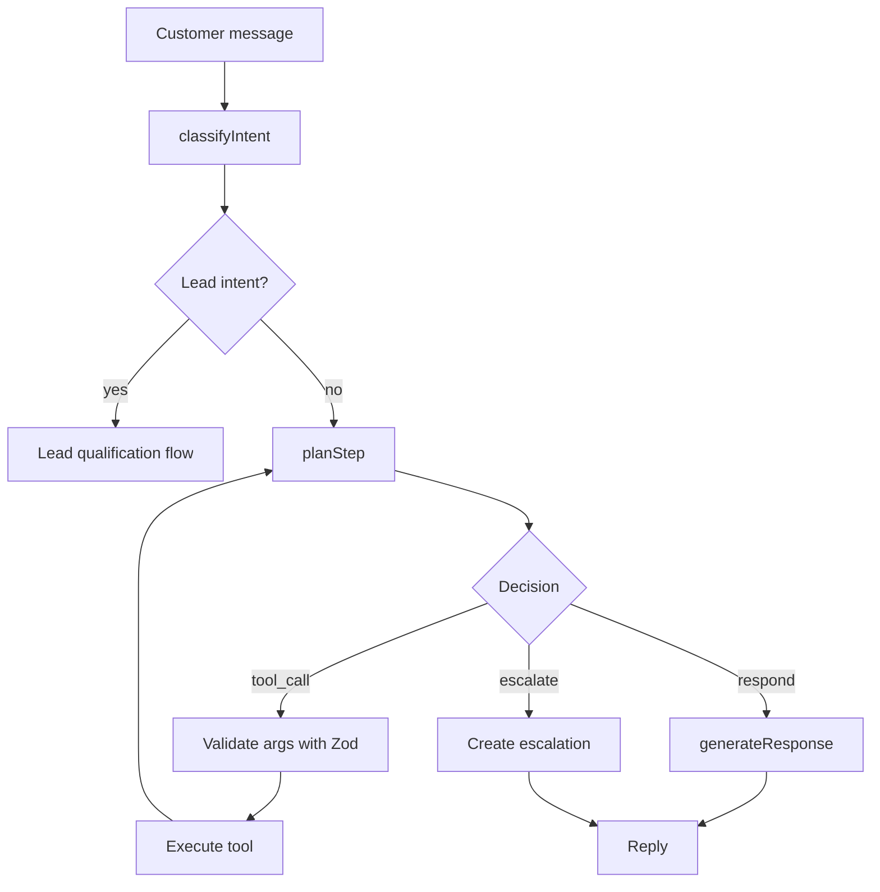

# Agent system

The core guarantee of the AgentDesk AI agent: **the model never invents data.**
Every answer comes from a validated tool result or a retrieved knowledge source.

## The loop

The loop (`lib/ai/agent.ts`) is bounded (max 6 tool iterations) to guarantee
termination.

## Intent classification

`classifyIntent(message)` returns `{ intent, confidence, entities }`. The
deterministic demo provider uses ordered, documented rules; the OpenAI provider
uses structured JSON output. Intents:

`order_status`, `refund_request`, `refund_policy`, `shipping_question`,
`pricing_question`, `lead_qualification`, `human_request`, `general_support`,
`unsupported`.

## Tool calling

Tools are defined in `lib/ai/tools/index.ts` with:

- a **name** and **description** (used for function calling in the live provider)
- a **Zod schema** for argument validation
- an **implementation** that reads real data from the database or a provider

Argument validation is `tool.schema.safeParse(...)` — invalid arguments produce
a logged failure, never a crash or a fabricated result.

The OpenAI provider converts Zod schemas to JSON Schema
(`z.toJSONSchema`) and uses native function calling. The demo provider uses a
deterministic planner (`planDeterministic`) that maps intent → tool sequence.

## Sensitive actions & escalation

The agent escalates when:

- confidence is below the configured threshold
- a customer asks for a human
- required information is unavailable (e.g. missing order number)
- a sensitive action requires approval (refund above `refundApprovalThresholdUsd`)
- a tool/API repeatedly fails

`refund_order` is marked `sensitive` and returns `requiresApproval` when the
amount exceeds the threshold. The agent then creates an `Escalation` with a
**concise decision summary** (not hidden chain-of-thought) for a human to
approve or reject.

## Lead qualification

Leads follow a transparent, multi-turn flow (`lib/ai/lead.ts`):

1. Extract fields (email, company, size, problem, budget, timeline) from the message.
2. Persist partial state on the `Lead` record.
3. Ask for the next missing required field until enough is collected.
4. Score with explicit rules (`scoreLead`) → status `NEW` / `NEEDS_MORE_INFO` / `QUALIFIED`.
5. On qualification: sync CRM contact + deal, dispatch the `LEAD_QUALIFICATION` job.

The scoring rules are documented in code and visible in the dashboard, not a black box.
